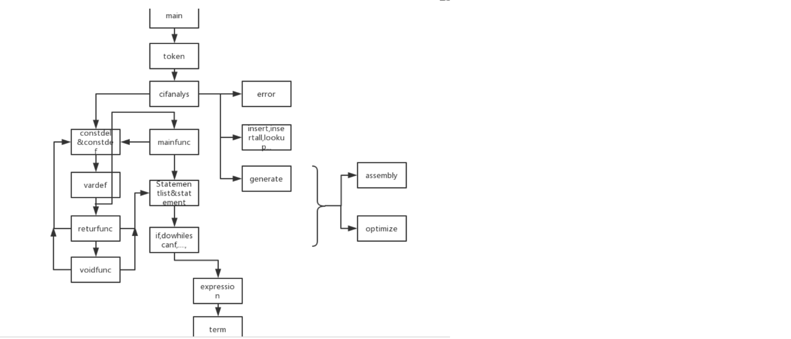

# C_Complier
this is the course project related to creating a c_complier

## Overview
The basic language used in this project is C language. this compiler can anaylize the syntactic  and grammatic of a C procedure.

## Instruction
./guidance: the detailed definition of the compiler (the current files are written in chinese, the english version might be uploaded in the future)

./code: the source code include the Lexanalysis, Syntax Analysis, assembly convert.

./optimize: the optimized version

## Framework

